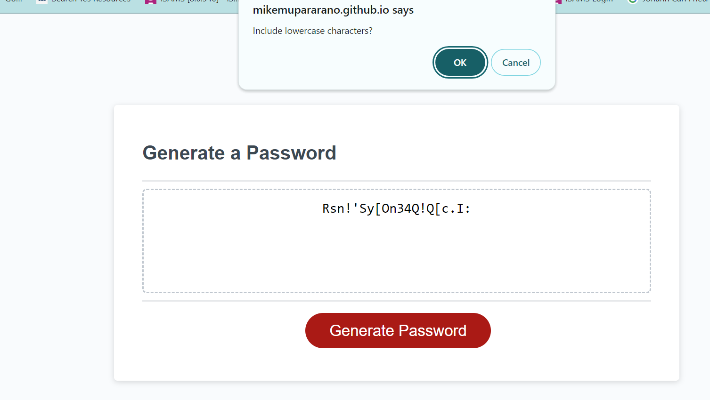
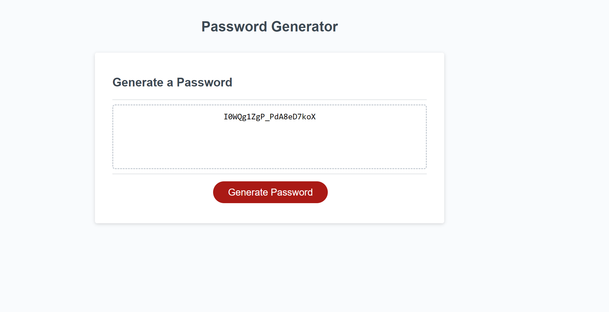

# Random-password-generator
## Description 
I have worked on using JavaScript to design strong and secure passwords. Why? Clients and companies are keeping their accounts and data online. Research shows that cybersecurity is rampant. 

To outwit cyber crime committing individuals, web developers need to make secure passwords through the use of a mix of uppercase, lowercase, symbols and numbers. Also, a secure password should have a minimum of 8 characters and a maximum of 128 characters. These requirements make it very difficult for scammers to guess a client's password.

It is important to point out that randomly generated passwords are not easy to remember. The solution lies in the inclusion of password storage. I have not had the privilege to create password storage in this web application and collaborators are encouraged to take advantage and collaborate on password storage in this repository.

Many customers use dictionary-based password generators that can be easily guessed because some words from the dictionary are easy to guess. However, this application requires the use of a combination of special characters, symbols, numbers, lowercase and uppercase letters.

I have used HTML, CSS and JavaScript to design a web application that generates secure and random passwords that many organisations could benefit from.

The project is located at the following link:
https://mikemupararano.github.io/Console-Finances/


## Table of Contents (Optional)
N/A

## Installation

No installation is required.

## Usage 
A screenshot of the work is shown here:




```


## Credits
To complete this task, I have used for example the following:
How to make a password generator in javaScript and why is one required: https://arhaanali.medium.com/how-to-make-a-password-generator-in-javascript-97a3de9a35d8
https://www.freecodecamp.org/news/basics-of-data-analysis-with-javascript/.
The website has examples on how to find the length of an array, determine the sum and loop through the array. 

## License
Readers should refer to the MIT License in the repository.

## Badges

N/A

## Features

N/A

## Contributing

As indicated in the description above, I have not included password storage facilities in this work. I would encourage collaboration to improve this web application so that it can store the passwords that are generated. Here is the link for any collaborations on this important matter:
https://github.com/Mikemupararano/random-password-generator

## Tests

N/A
---

© 2023 edX Boot Camps LLC. Confidential and Proprietary. All Rights Reserved.
